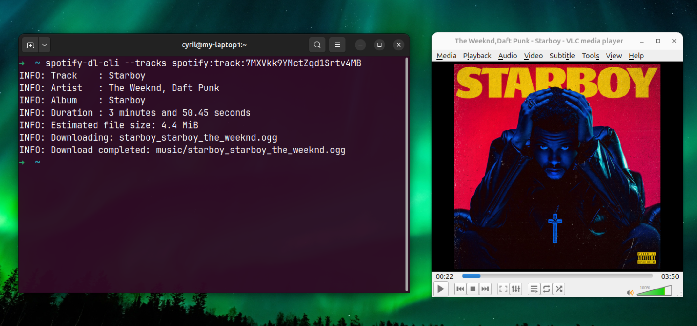

# spotify-dl-cli

### It lasted 3 days...
### The Spotify DRM version used by this repository (desktop client 1.2.31.1205) has been banned. 😥
### Not working anymore ...

#

`spotify-dl-cli` is a proof-of-concept (POC) command-line project to download Spotify tracks by emulating Spotify DRM routines to decrypt protected streams. **NO PREMIUM ACCOUNT REQUIRED**

> This project is the result of a reverse engineering study of Spotify’s authentication and content protection mechanisms, from authorization to final audio stream decryption.

<sub>Discord: cyril13600</sub>



### ⭐ Like the project ? Consider giving it a star.

## Quick Start

1. Prerequisite: ensure `pipx` is installed and available in your `PATH` (see [Troubleshoot](#troubleshoot)).

2. Install with `pipx` from GitHub (requires Python 3.10+):

```bash
pipx install git+https://github.com/cycyrild/spotify-dl-cli.git
```

3. Start with a first download command:

```bash
spotify-dl-cli "spotify:track:YOUR_TRACK_ID"
```

> Note: To get a Spotify URI for a track or playlist in the Spotify web or desktop app, right-click the item, go to **Share**, hold `Ctrl`, then click **Copy Spotify URI**.

4. On first run, the CLI prints a Spotify authorization link. Open it, sign in, and approve access.
5. After approval, the token is saved and the download continues to `music/`.

```bash
spotify-dl-cli "spotify:track:7MXVkk9YMctZqd1Srtv4MB"
WARNING: Open the following URL to authorize Spotify access:
WARNING: https://accounts.spotify.com/authorize?...
INFO: Obtained new access token, expires in 3600 seconds
INFO: Track    : Starboy
INFO: Artist   : The Weeknd, Daft Punk
INFO: Album    : Starboy
INFO: Download completed: music/starboy_starboy_the_weeknd.ogg
```

## How it works (very, very quickly ...)

This project focuses on the audio stream decryption layer, the most complex and least documented part of Spotify’s delivery pipeline.

*Why emulate the official client rather than reimplement everything ?* \
*Because the Spotify desktop binary is heavily obfuscated (e.g., VMProtect-style virtualization ...), clean reimplementation of the DRM logic would require extensive deobfuscation. \
Emulation provides a practical way to execute the original routines without fully reversing those protections.*

A CPU emulator loads and executes the original Windows PE binary of the Spotify desktop client, calling its native decryption routines directly rather than reimplementing them.

1. The CLI requests an `obfuscated_key` from the PlayPlay (Spotify’s DRM) endpoint for the target file.
2. The emulated desktop client derives the final content decryption key from `obfuscated_key` and `content_id`.
3. The encrypted audio stream is fetched in chunks and decrypted in place using the emulated keystream routine.
4. Decrypted chunks are reassembled into valid Ogg pages and written to disk with proper metadata.

## Troubleshoot

If `pipx` is missing or not recognized, install it and add it to your `PATH`:

### Windows

```bash
py -m pip install --user pipx
py -m pipx ensurepath
```

### Linux / macOS

```bash
python3 -m pip install --user pipx
python3 -m pipx ensurepath
```

Restart your terminal after running `ensurepath`.

## Legal Notice

This project is provided for educational, interoperability, and security research purposes only.

You are solely responsible for how you use this software and for complying with all applicable laws, regulations, and contracts in your jurisdiction. This includes copyright and anti-circumvention laws, and Spotify's terms and policies.

You must not use this project to infringe copyright, violate platform terms, bypass access controls unlawfully, or facilitate unauthorized copying/ripping/distribution of content.

This project is not affiliated with, endorsed by, or sponsored by Spotify. "Spotify" and related marks are the property of their respective owners.

If you are a rights holder and believe material in this repository infringes your rights, please contact the maintainers for prompt review/removal.

This software is provided "AS IS", without warranty of any kind, express or implied. The maintainers disclaim liability for misuse or damages arising from use of this project.

> This notice is not legal advice.
