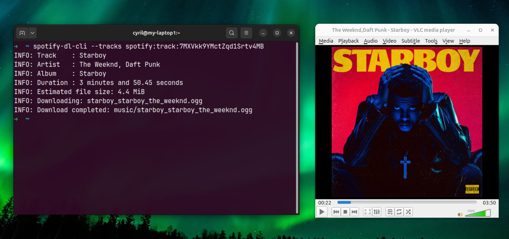

# spotify-dl-cli

`spotify-dl-cli` is a proof-of-concept command-line project exploring reverse engineering techniques on a proprietary desktop client.

The project demonstrates how native routines embedded in a protected Windows application can be analyzed and executed through CPU emulation to understand parts of a media delivery workflow.

> This project is the result of a reverse engineering study of a proprietary client's authentication and media processing mechanisms, from authorization to native routine execution involved in playback.

> [!WARNING]
This project is **not functional out of the box**. Some required components cannot be included due to legal restrictions. It is provided **for exploration and educational purposes only**.

## Latest improvements
Changes
* Bypass of Spotify Plaplay custom cipher
* Removed full cipher derivation pipeline (derivedKey -> state -> generate_keystream)
* Direct capture of native AES decryption key

Benefits
* Significantly faster decryption
* Eliminates 16-byte keystream generation loop
* Generated AES keys remain valid across Playplay DRM changes (unless CDN encryption is modified)

**NOTE:** Playplay 5 uses a virtual machine driven by MSVC C++ exceptions. A minimal Python SEH dispatcher was implemented to emulate `_CxxThrowException`.

Discord: cyril13600

## How it works (very, very quickly ...)

Instead of reproducing Spotify’s Playplay cipher, the emulator executes the native Playplay routine and **captures the final AES key directly in memory**.

Process:

1. Run Playplay VM initialization
2. Call `vm_object_transform` with `content_id` + `obfuscated_key`
3. Hook the AES key generation point
4. Capture the **runtime-generated AES-CTR key**
5. Decrypt audio directly using native AES-CTR

## Legal Notice

This project is provided for educational, interoperability, and security research purposes only.

You are solely responsible for how you use this software and for complying with all applicable laws, regulations, and contracts in your jurisdiction. This includes copyright and anti-circumvention laws, and Spotify's terms and policies.

You must not use this project to infringe copyright, violate platform terms, bypass access controls unlawfully, or facilitate unauthorized copying/ripping/distribution of content.

This project is not affiliated with, endorsed by, or sponsored by Spotify. "Spotify" and related marks are the property of their respective owners.

If you are a rights holder and believe material in this repository infringes your rights, please contact the maintainers for prompt review/removal.

This software is provided "AS IS", without warranty of any kind, express or implied. The maintainers disclaim liability for misuse or damages arising from use of this project.

> This notice is not legal advice.
